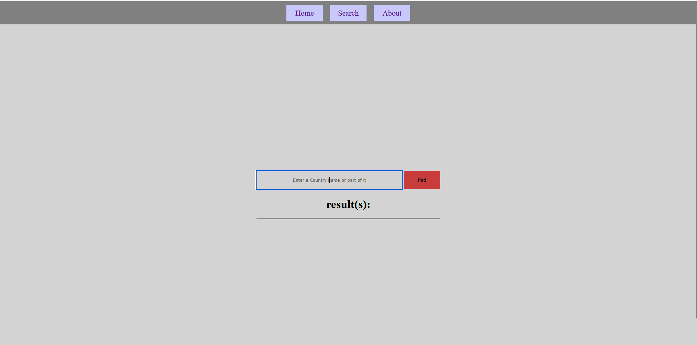
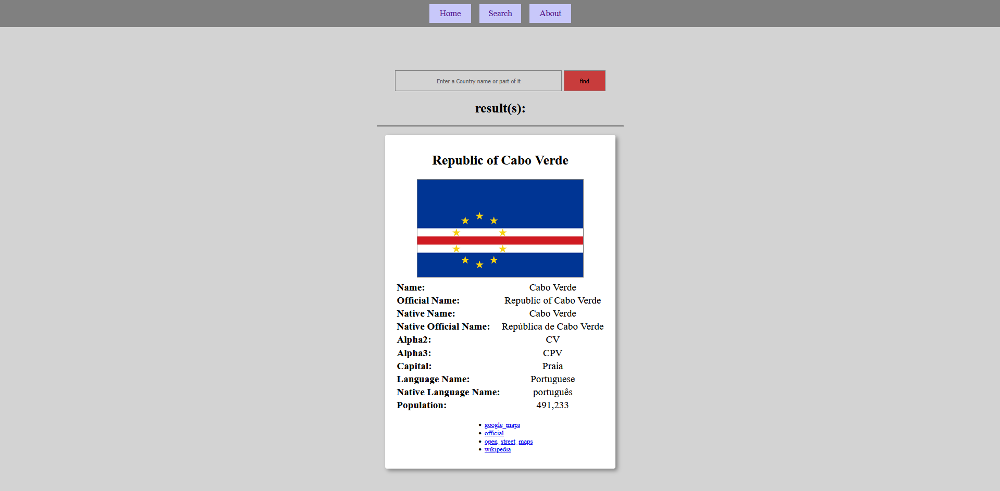

# 🌍 Country Search Website

## Overview

Country Search Website is a web application developed with **Java Spring Boot** that allows users to search for countries and explore detailed information about them.

The application provides an easy and user-friendly interface where users can enter a country name and receive information such as the country's official name, common name, flag, capital city, population, languages, native names, and useful related links.

This project uses the **REST Countries API** to retrieve up-to-date country information. The API provides structured data about countries around the world, which is processed by the application and displayed dynamically using **Thymeleaf templates**.

The backend is implemented using **Spring Boot and Java**, where HTTP requests are handled by controllers, external API communication is managed through a service layer, and JSON responses are converted into Java objects using **Jackson ObjectMapper**.

The goal of this project is to demonstrate how a Spring Boot application can communicate with external REST APIs, process JSON data, and build a dynamic web interface for users.

