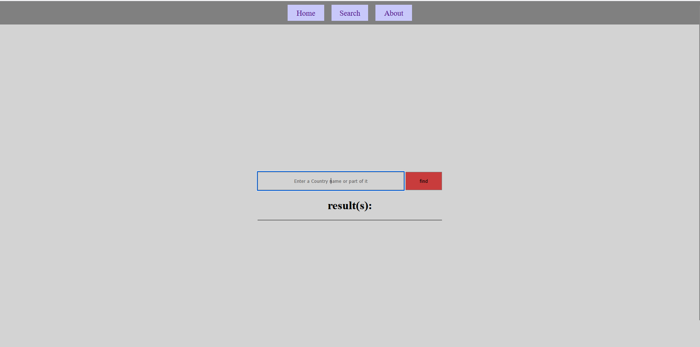
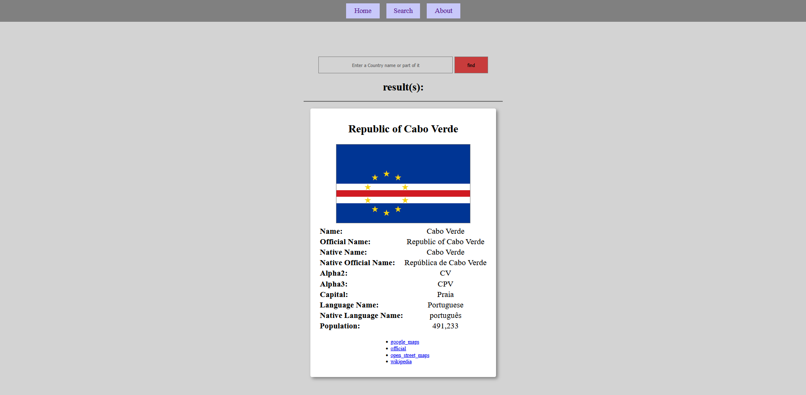

# Country Search Application 🌍

A web application for searching and displaying detailed information about countries around the world using the **REST Countries API**.

The application allows users to search for a country and view complete information including names, codes, capital, population, languages, currencies, and other geographic details.

---

## 📸 Screenshots

### Search Country

---

## ✨ Features

- 🔍 Search countries by name

- 🌍 Display detailed country information:

  - Country Name
  - Official Country Name

  - Native Country Names:
    - Multiple native names in different languages

  - Native Official Country Names:
    - Official names in native languages

  - Country Codes:
    - Alpha-2 Code
    - Alpha-3 Code

  - Capital City

  - Languages:
    - Language Name
    - Native Language Name

  - Population Information

---

## 🛠 Technologies Used

- Java
- Spring Boot
- Spring Web
- REST API
- JSON
- HTML
- CSS
- JavaScript
- Thymeleaf

---

## 📡 API

This project uses:

**REST Countries API**

to retrieve country information.

The application sends requests to the API and processes JSON responses to display country details.

---

## 🚀 How It Works

1. User enters a country name.
2. Spring Boot sends a request to REST Countries API.
3. API returns country data in JSON format.
4. Application converts JSON data into Java objects.
5. Country information is displayed on the web page.

---

